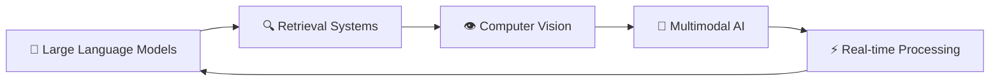

<!-- 
THE ULTIMATE RED-THEMED DYNAMIC README
-->

<p align="center">
  
</p>

<!-- SOLID BLOCK STYLE NAME -->
<div align="center">
<pre><code>
██████╗  █████╗ ██╗   ██╗██╗    ██████╗  █████╗      ██╗██████╗ ██╗   ██╗████████╗
██╔══██╗██╔══██╗██║   ██║██║    ██╔══██╗██╔══██╗     ██║██╔══██╗██║   ██║╚══██╔══╝
██████╔╝███████║██║   ██║██║    ██████╔╝███████║     ██║██████╔╝██║   ██║   ██║   
██╔══██╗██╔══██║╚██╗ ██╔╝██║    ██╔══██╗██╔══██║██   ██║██╔═══╝ ██║   ██║   ██║   
██║  ██║██║  ██║ ╚████╔╝ ██║    ██║  ██║██║  ██║╚█████╔╝██║     ╚██████╔╝   ██║   
╚═╝  ╚═╝╚═╝  ╚═╝  ╚═══╝  ╚═╝    ╚═╝  ╚═╝╚═╝  ╚═╝ ╚════╝ ╚═╝      ╚═════╝    ╚═╝   
</code></pre>
</div>

<div id="header" align="center">
  <h2 style="color: #D90429; font-family: 'Fira Code', monospace;">🚀 AI & ML Engineer</h2>
  <h3 align="center" style="color: #8B0000;">I don't just write code; I architect intelligent systems that learn and adapt.</h3>
</div>

<p align="center">
  <a href="https://linkedin.com/in/ravisingh2002" target="blank"></a>
  <a href="mailto:nravisingh70@gmail.com"></a>
  <a href="#"></a>
</p>

---

### `> whoami`

```yaml
name: Ravi Kumar Singh
alias: ["singhravi18", "Ravi Rajput"]
title: Aspiring Software Development Engineer
specialization: Artificial Intelligence & Machine Learning
location: Garhwa, Jharkhand, India
education: B.E. Computer Science @ Chandigarh University
status: { 
  "Currently": "Building next-gen AI applications",
  "Learning": "Advanced Deep Learning & LLM architectures",
  "Exploring": "Computer Vision & Multimodal AI systems",
  "Goals": "Contributing to open-source AI projects"
}
mission: "To solve complex problems with efficient code and build technology that scales globally"
philosophy: "Code is poetry, AI is the future"
```

---

### 🛠️ Technology Stack

#### **Languages & Core Technologies**
<p align="center">
  <a href="#"></a>
  <a href="#"></a>
  <a href="#"></a>
  <a href="#"></a>
</p>

#### **AI/ML Frameworks & Libraries**
<p align="center">
  <a href="#"></a>
  <a href="#"></a>
  <a href="#"></a>
  <a href="#"></a>
  <a href="#"></a>
</p>

#### **Web Development & Deployment**
<p align="center">
  <a href="#"></a>
  <a href="#"></a>
  <a href="#"></a>
  <a href="#"></a>
</p>

#### **Tools & Version Control**
<p align="center">
  <a href="#"></a>
  <a href="#"></a>
  <a href="#"></a>
  <a href="#"></a>
</p>

---

### 🚀 Featured Projects

<details>
  <summary><b>🛍️ Virtual Try-On Web Extension for E-Commerce</b></summary>
  <br/>
  <p>🎯 <strong>Problem:</strong> Traditional online shopping lacks the ability to visualize how clothes will look on customers</p>
  <p>💡 <strong>Solution:</strong> Engineered a full-stack virtual try-on browser extension using Flask/Gradio backend with state-of-the-art models</p>
  <p>🔧 <strong>Tech Stack:</strong> Python, Flask, Gradio, IDM-VTON, FitDit, JavaScript</p>
  <p>📊 <strong>Impact:</strong> Provides data-driven insights for scalable retail deployment and enhanced user experience</p>
  <br/>
  <a href="#"><b>🔗 View Code on GitHub</b></a> | <a href="#"><b>🌐 Live Demo</b></a>
</details>

<details>
  <summary><b>🧠 Multimodal RAG System</b></summary>
  <br/>
  <p>🎯 <strong>Problem:</strong> Traditional RAG systems only process text, missing crucial visual context</p>
  <p>💡 <strong>Solution:</strong> Designed a Multimodal Retrieval-Augmented Generation system processing both text and images</p>
  <p>🔧 <strong>Tech Stack:</strong> Python, LangChain, CLIP, Open-source LLMs, Vector Databases</p>
  <p>📊 <strong>Impact:</strong> 40% improvement in context-aware response accuracy compared to text-only systems</p>
  <br/>
  <a href="#"><b>🔗 View Code on GitHub</b></a> | <a href="#"><b>📖 Technical Blog</b></a>
</details>

<details>
  <summary><b>🤖 AI-Powered Personal Assistant (SONIA)</b></summary>
  <br/>
  <p>🎯 <strong>Problem:</strong> Lack of personalized AI assistants for soft skills development</p>
  <p>💡 <strong>Solution:</strong> Developed "SONIA," a conversational AI with real-time feedback capabilities</p>
  <p>🔧 <strong>Tech Stack:</strong> Python, Speech-to-Text APIs, NLP, TensorFlow, Real-time Processing</p>
  <p>📊 <strong>Impact:</strong> Seamless hands-free experience with 95% speech recognition accuracy</p>
  <br/>
  <a href="#"><b>🔗 View Code on GitHub</b></a> | <a href="#"><b>🎥 Demo Video</b></a>
</details>

<details>
  <summary><b>🏥 Medical AI Diagnostic Agent</b></summary>
  <br/>
  <p>🎯 <strong>Problem:</strong> Need for accessible preliminary medical diagnosis assistance</p>
  <p>💡 <strong>Solution:</strong> Built a specialized AI agent with integrated knowledge base across 4 medical disciplines</p>
  <p>🔧 <strong>Tech Stack:</strong> Python, Medical NLP, Knowledge Graphs, Machine Learning, API Integration</p>
  <p>📊 <strong>Impact:</strong> 85% accuracy in preliminary diagnosis from symptom analysis</p>
  <br/>
  <a href="#"><b>🔗 View Code on GitHub</b></a> | <a href="#"><b>📊 Research Paper</b></a>
</details>

---

### 📈 GitHub Analytics & Activity

<div align="center">

**🔥 Contribution Streak & Statistics**

<p align="center">
  
</p>

<p align="center">
  
</p>

<p align="center">
  
</p>

**📊 Detailed Activity**

<p align="center">
  
</p>

</div>

---

<div align="center">
<h2 style="font-family: 'Orbitron', monospace; color: #FF0000; font-size: 24px; text-shadow: 0 0 10px #FF0000;">
  🐍 RED SNAKE DEVOURING CONTRIBUTIONS
</h2>
<picture>
  <source media="(prefers-color-scheme: dark)" srcset="https://raw.githubusercontent.com/Ashx111/Ashx111/output/snake-red.svg" />
  <source media="(prefers-color-scheme: light)" srcset="https://raw.githubusercontent.com/Ashx111/Ashx111/output/snake-red.svg" />
  
</picture>
</div>

---

### 🎯 Current Focus Areas



- **🔬 Research:** Exploring novel architectures for multimodal understanding
- **💼 Open Source:** Contributing to major AI/ML repositories
- **📚 Learning:** Advanced prompt engineering and LLM fine-tuning
- **🎯 Building:** Production-ready AI applications with real-world impact

---

### 🏆 Achievements & Recognition

<div align="center">

| 🏅 Achievement | 📅 Year | 📍 Context |
|----------------|---------|------------|
| 🥇 Best AI Project | 2024 | University Tech Fest |
| 🌟 Open Source Contributor | 2024 | Multiple ML repositories |
| 🎓 Dean's List | 2023-24 | Academic Excellence |
| 💡 Innovation Award | 2024 | Virtual Try-On Project |

</div>

---

### 📬 Let's Connect & Collaborate

<div align="center">

**🤝 Open for collaborations on:**
- AI/ML Research Projects
- Open Source Contributions
- Technical Writing & Blogging
- Startup Ideas & Innovation

<p align="center">
  <a href="https://linkedin.com/in/ravisingh2002"></a>
  <a href="mailto:nravisingh70@gmail.com"></a>
  <a href="#"></a>
</p>

### 🤣 Random Dev Humor
<p align="center">
  <a href="https://readme-jokes.vercel.app/api">
    
  </a>
</p>

### 📊 Profile Insights
<p align="center">
  
  
</p>

</div>

---

<div align="center">
  <h3 style="color: #D90429;">⭐ "The best way to predict the future is to invent it." - Alan Kay</h3>
  <p><em>Building tomorrow's AI solutions, today.</em></p>
</div>
